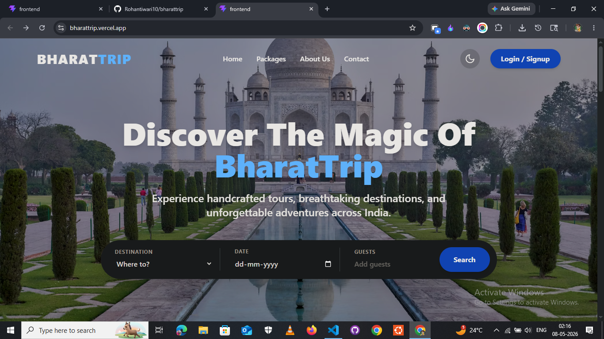

# 🇮🇳 BharatTrip - The Ultimate Travel Agency Platform



**🚀 Live Demo:** [https://bharattrip.vercel.app/](https://bharattrip.vercel.app/)

> **BharatTrip** is a modern, full-stack travel booking application built with the **MERN** stack. It allows travelers to discover handcrafted tour packages across India, make instant inquiries using a "Book Now - Pay Later" flow, and manage their trips. 

This project features a complete **User Dashboard** for customers and an **Admin Panel** for agency owners to manage inventory, upload images, and update customer booking statuses.

---

## ✨ Key Features

### For Users 🧑‍💼
- **Explore Packages:** Browse beautifully presented travel destinations.
- **Smart Search:** Filter packages by destination name directly from the hero search bar.
- **Secure Authentication:** Sign up, log in, or optionally "Continue as Guest" using JWT-based authentication.
- **Booking Engine:** Clean checkout modal to select travel dates, guest count, and provide contact details.
- **User Dashboard:** A personalized space to track upcoming trips and monitor booking statuses (Pending, Confirmed, Cancelled).
- **Dark Mode:** Fully responsive UI with a seamless Light/Dark mode toggle.

### For Admins 👑
- **Protected Admin Routes:** Only authorized admin accounts can access the dashboard.
- **Manage Inventory:** Full CRUD functionality (Create, Read, Update, Delete) to add new travel packages.
- **Image Uploads:** Upload high-quality cover images for destinations (powered by `multer`).
- **Customer Bookings:** A dedicated tab to view all inbound reservations, customer phone numbers, and total prices.
- **Status Management:** Easily update a booking's status from "Pending" to "Confirmed" once payment is collected.

---

## 🛠️ Tech Stack

**Frontend:**
- React.js (Vite)
- Tailwind CSS (Styling & Dark Mode)
- React Router DOM (Routing)

**Backend:**
- Node.js & Express.js (Server & API API)
- MongoDB & Mongoose (Database & Modeling)
- JSON Web Tokens (JWT) & bcryptjs (Authentication & Security)
- Multer (File Uploads)

---

## 🚀 Getting Started (Local Development)

Follow these steps to set up the project on your local machine.

### 1. Clone the repository
```bash
git clone https://github.com/YOUR_USERNAME/bharattrip.git
cd bharattrip
```

### 2. Setup the Backend
Navigate to the `backend` folder and install dependencies:
```bash
cd backend
npm install
```
Create a `.env` file in the `backend` directory and add the following variables:
```ini
PORT=5000
MONGO_URI=your_mongodb_connection_string
JWT_SECRET=your_super_secret_jwt_key
```
Run the server:
```bash
node server.js
```
*(The server will start on `http://localhost:5000`)*

### 3. Setup the Frontend
Open a new terminal window, navigate to the `frontend` folder, and install dependencies:
```bash
cd frontend
npm install
```
Create a `.env` file in the `frontend` directory and add the following variable:
```ini
VITE_API_URL=http://localhost:5000
```
Start the Vite development server:
```bash
npm run dev
```
*(The app will open on `http://localhost:5173`)*

---

## 🌐 Deployment

This project is currently deployed and live at: **[https://bharattrip.vercel.app/](https://bharattrip.vercel.app/)**

Deployment Architecture:
- **Frontend:** Hosted on Vercel.
- **Backend:** Hosted on Render.
- **Database:** Hosted on MongoDB Atlas.

---

## 🤝 Contributing
Contributions, issues, and feature requests are welcome! Feel free to check the issues page if you want to contribute.

**Developed with ❤️ by [Your Name/Username]**